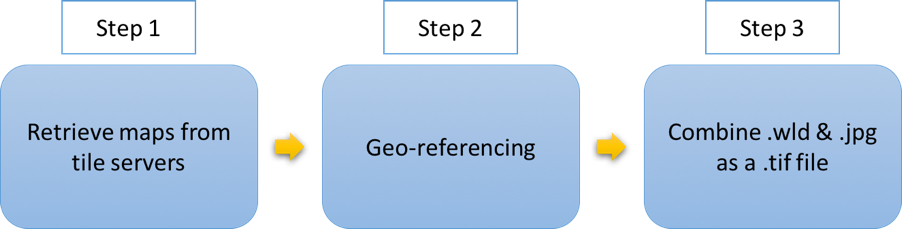
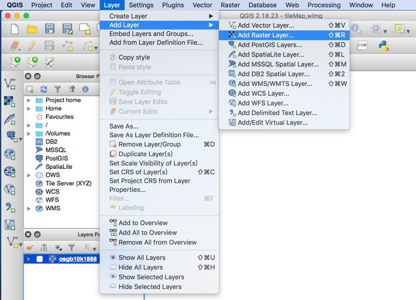
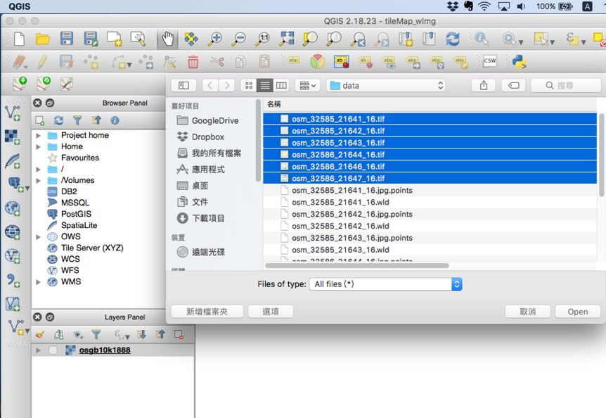

# Historical Map Retrieval
The workflow for historical map retrival is as following

## Retrieve Map Using Tile Indexes

This code can retrieve tiled web map (or slippy map) from different tile servers. 
Given the boundary of desired latitude and longitude, the code will transfer into tile index and retrieve map based on the URL of tile servers.

The output will be map image (jpeg file) and its (latitude, longitude) bounding box (text file).

 `retrieveMap_byxyz _nlsosm.py` retrieves the map tiles from the NLS server and Open Street Map server. 
 
 ## Georeferencing 
 
Run  `generate_wld_file` to generate corresponding world file and point file for jpg files. Then feed the resulting world file and jpg files to gdal to convert to geotiff files.
 
QGIS can be used to view the geotiff file. 

